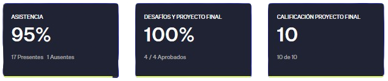

# Curso de Desarrollo Web - Ene. 2023

   

En este curso realizado en Coderhouse, el objetivo principal fue el de desarrollar una página web estática desde cero con una temática a decisión personal, utilizando buenos hábitos de programación, semántica y organización. Además de aprender sobre manejo de versiones, diseño, presupuestado y análisis de requerimientos.

## ✨ Puntos destacables:
- _Diseño responsive_
- _Empleo de controlador de versiones con Git y Github_
- _Uso de scripts y la terminal_
- _Crear estilos utilizando SASS_
## 💻 Programas y tecnologías utilizadas

  
  
  
  
  
  

## 🔗 Link

[Ver el sitio en línea](https://lucasdlabo.github.io/HTML.CSS-Coderhouse-2023/)

------------
## 🏅 Temática escogida

   

Hotline Miami es un videojuego 2D shooter en donde se debe de eliminar a todos los enemigos del nivel para poder continuar con el siguiente. El mismo cuenta con múltiples desbloqueables, formas de jugar y, a mi gusto, una increíble banda sonora.

Por esto mismo, decidí enfocar mi primera página web en uno de mis videojuegos favoritos y poder mostrar diferentes puntos y contenido de Hotline Miami.
### Apartados de la página:
- _Reviews y puntaje del videojuego_
- _Máscaras disponibles_
- _Armas disponibles_
- _Ranking de canciones más escuchadas_

## 📝 Criterios de evaluación

- [x] Creación o mockup del diseño web. [Ver diseño](https://www.figma.com/file/pB6cGMVyxoMMEn5pjcfhwR/Hotline-Web-Page?node-id=0%3A1&t=0utVFc8ZFEHqQaj0-1 "Figma")
- [x] Estructura del sitio web, maquetado, diseño y código de calidad.
- [x] 5 páginas dentro de la webpage como mínimo.
- [x] Diseño 100% responsive para:
    - _Escritorio_
    - _Laptop_
    - _Movíl_
    - _Tableta_
- [x] Buenas prácticas de SEO.
- [x] Diseño organizado con SASS aprovechando:
    - _Mixins_
    - _Variables_
    - _Extends_
    - _Partials_
- [x] Creación de un presupuesto. [Ver presupuesto de ene. 2023](https://www.canva.com/design/DAFZpIiv7QY/UFxT6jHGqZr2dwV-lOdCKg/edit?utm_content=DAFZpIiv7QY&utm_campaign=designshare&utm_medium=link2&utm_source=sharebutton "Presupuesto")
- [x] Entrega del proyecto mediante repositorio

## 📊 Detalles de la cursada

   

## 📜 Certificado de finalización 
Curso finalizado el **12 de febrero del 2023**.
[Ver certificado](https://pub.coderhouse.com/legacy-certificates/63e94ee13b4e73000e216029?lang=es)

------------

## ℹ️ Otros
### Fuentes utilizadas

Fuente _Justice_ usada de [Dafont](https://www.dafont.com/justice.font)

 
 
 
 

### Aclaración
Sitio web con fines meramente ilustrativos y educativos. Todos los derechos corresponden a Dennaton Games y Devolver Digital. 